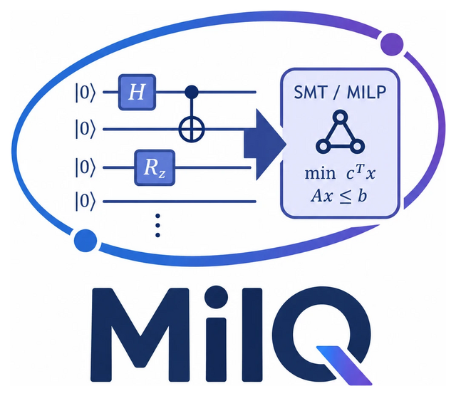

<p align="center">
  
</p>

# MILQ: A tool for gate-count optimal Quantum circuit synthesis

[](https://github.com/QuantumFIT/milq/actions/workflows/ci.yml)
[](https://codecov.io/gh/QuantumFIT/milq)

**MILQ** (**M**ixed **I**nteger linear programming & first order **L**ogic **Q**uantum circuit synthesis) is a tool for gate-count optimal quantum circuit synthesis for `OPENQASM` circuits using SMT and MILP encodings.

Supported solvers:
dReal, z3, cvc5, opensmt, yices2, smtinterpol, Gurobi

## Installation Guide
**Dependencies:**
- dReal solver 4.21.06.2 -- Refer to the [Installation Guide](https://github.com/dreal/dreal4)
- z3 solver -- `sudo apt install z3`
- to use `smtinterpol`, Java 21.0.10 is required (`sudo apt install openjdk-21-jdk`)
- dependencies in `requirements.txt`
```
pip install -r requirements.txt
```
- Gurobi License for 13.0.1 version (Get free academic license on [Gurobi site](https://www.gurobi.com/)), refer to their installation manuals and create `gurobi.lic` file. (The license is not re-distributable without explicit agreement with Gurobi)

```
chmod +x solvers/smtinterpol/smtinterpol
chmod +x solvers/cvc5/cvc5
chmod +x solvers/opensmt/opensmt
chmod +x solvers/yices2/yices_smt2
```

## Usage
To synthesize a quantum circuit, use the `cli/cli.py` script. 

CLI flags for exact synthesis:
- `-v` pick what vectors to use in the synthesis (either |0>^n, all CBS, jamiolkowski identity vector, or the three RUS states)
- `-s` pick a solving method (gurobi, milp, smt) -- milp is for PuLP pure MILP formulations
- `-m` choose the synthesis mode -- either incremental, basic, or one of search methods that minimize the gate variables
- `-a` choose a solver to use in the solving (portfolio or one of the supported solvers)
- `-o` output circuit file
- `-c` representation of complex numbers (Classic for a+bj, FiveTuple for algebraic five-tuples)
- `-u` for up to global phase equivalence instead of identity check
- `-nm` to ignore end-of-circuit measurements
- `-d` synthesize up to an allowed depth


Approximate synthesis uses the `-ap` flag and a set `-f X` fidelity threshold `X` (in [0,1])

RUS synthesis can also require the specification of `-T X`, `-A Y` to specify the number of target qubits `X` and number of ancillae `A`.

Examples of execution inside of the `cli/` folder:

- SMT portfolio (five-tuples, incremental) - state |0>^n
```
python3 cli.py -v zero -c FiveTuple -s smt -a portfolio -m incremental ../benchmarks/ghzzero/2.qasm
```
-  Gurobi (a+bj, incremental) - state |0>^n
```
python3 cli.py -v zero -c Classic -s gurobi -m incremental ../benchmarks/ghzzero/2.qasm
```
- Gurobi (five-tuples, incremental), all CBS synthesis
```
python3 cli.py -v all -c FiveTuple -s gurobi -m incremental ../benchmarks/ghzzero/2.qasm
```


## Running tests
```
pip install pytest
pytest
```
The tests use the bundled yices2/cvc5 binaries and the size-limited license shipped with `gurobipy`. They run in CI on every push and pull request. Known bugs are marked `xfail` with their issue number. Strict mode is on, so a fix must remove its marker from `KNOWN_BUGS` in `tests/test_simulator.py`.

## Project Structure

```
- README.md
- requirements.txt
- benchmarks/
| - ghzzero (GHZ circuits)
| - bernstein-vazirani (BV circuits)
| - qsharp (benchmarks for comparison with Quokka#)
| - mqt-bench (MQT benchmark library Clifford+T circuits)
| - rus (repeat-until-success circuits)
- solvers/
| ... (solver binaries from SMT-comp -- cvc5, opensmt, yices2...)
- cli/
| - cli.py (CLI interface for Synthesis)
| - simulator.py (CLI interface for our small simulator module)
- src/
| - complex/
| | - classic.py (a+bj)
| | - ntuple.py (algebraic n-tuples)
| | - fivetuple.py (algebraic fivetuples)
| | - matrix.py (unitary matrices)
| | - vector.py (vector abstraction)
| - gates.py (Gate-Set, Circuit, and Gates abstractions)
| - generator.py (generating of SMT formulae or MILP programs)
| - logger.py (logging)
| - pareto.py (pareto front)
| - parser.py (parsing of solver outputs)
| - sim.py (simulator module)
| - solvers.py (abstraction over SMT solvers and Portfolio solver)
| - synth.py (main synthesis module)
```
